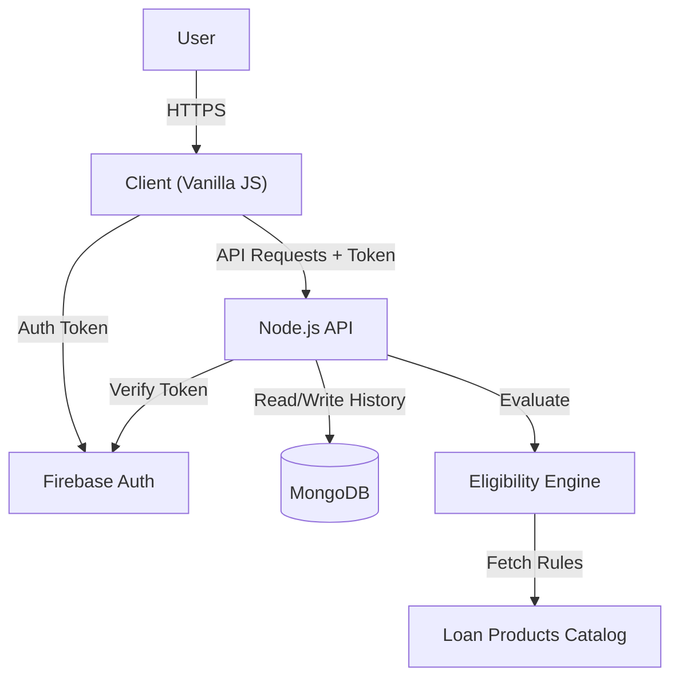

# CrediWise - Smart Loan Eligibility System

## 1. Project Overview

**CrediWise** is a full-stack web application designed to help users determine their eligibility for various loan products (Personal, Home, Education, Business) from multiple lenders. It features a smart "Eligibility Engine" that evaluates user financial data against strict lender constraints, simulates credit scores if missing, and provides transparent feedback on approval or rejection.

### Key Features

- **Smart Eligibility Check**: specific constraints (Income, FOIR, Credit Score, Employment).
- **Credit Score Simulator**: Estimates creditworthiness based on income and debt if no score is provided.
- **Multi-Lender Marketplace**: Compares products from simulated lender profiles.
- **User Dashboard**: Tracks history of eligibility checks and displays status analysis.
- **Smart Recommendations**: Suggests products based on eligibility tiers (e.g., "Highly Eligible" vs "Conditional").
- **Admin Dashboard**: Manages loan products and views user/application metrics.
- **Secure Authentication**: Firebase Auth integrated with a custom Node.js backend.
- **Live Deployment**: Hosted on Vercel at (https://credwise-five.vercel.app/)

---

## 2. Technical Architecture

### Tech Stack

- **Frontend**: Vanilla JavaScript (ES6+), HTML5, CSS3.
- **Backend**: Node.js, Express.js.
- **Database**: MongoDB (via Mongoose).
- **Authentication**: Firebase Authentication (Client-side) + JWT Verification (Server-side).
- **Deployment**: Vercel (Frontend & Backend compatible).

### System Diagram



### Folder Structure

```text
crediwise-main/
├── server/                 # Backend
│   ├── config/             # DB and Firebase config
│   ├── controllers/        # Request handlers
│   ├── services/           # Business Logic (Engine, Calculator)
│   ├── models/             # Mongoose Schemas & Mock Layers
│   ├── routes/             # API Routes
│   ├── middleware/         # Auth Middleware
│   └── data/               # Seed data
├── app.js                  # Main UI Logic & API usage
├── firebase-init.js        # Dynamic Firebase config
├── index.html              # Single Page Application
├── style.css               # Custom styling
└── package.json            # Dependencies
```

---

## 3. Backend Documentation

### Core Services

#### 1. Eligibility Engine (`server/services/eligibilityEngine.js`)

The heart of the system. It processes user input against `loanProducts.js`.

- **FOIR & DTI Calculation**:
  - **FOIR**: `(ExistingEMI + NewEMI) / MonthlyIncome`.
  - **Ranges**:
    - **< 40%**: `HIGHLY_ELIGIBLE` ("Matches with premium lenders").
    - **40% - 50%**: `CONDITIONAL` ("Requires Alternative Data").
    - **> 50%**: `REJECTED` ("Too much debt").
- **Score Simulation**: Base 650 + Bonuses for Salaried (+50), High Income (+40), Low Debt (+30).
- **Constraint Matching**: Checks `minIncome`, `minCreditScore`, `maxFOIR`, and `allowedEmployment`.

#### 2. Loan Products (`server/services/loanProducts.js`)

A configuration file acting as a catalog. Example structure:

```javascript
{
  lenderName: "HDFC Bank",
  constraints: {
    minCreditScore: 700,
    maxFOIR: 60,
    minIncome: 25000,
    allowedEmployment: ["Salaried"]
  }
}
```

### API Reference

Base URL: `/api`

|  Method  | Endpoint               | Description                                                            | Auth Required |
| :------: | :--------------------- | :--------------------------------------------------------------------- | :-----------: |
| **POST** | `/eligibility/check`   | Runs the eligibility engine. Accepts income, tenure, loan amount, etc. |      ✅       |
| **GET**  | `/eligibility/history` | Returns past checks for the logged-in user.                            |      ✅       |
| **POST** | `/eligibility/what-if` | Simulates how changing income/tenure affects eligibility.              |      ✅       |
| **GET**  | `/loans/recommend`     | (Public) Returns general top loan products.                            |      ❌       |
| **GET**  | `/super/products`      | (Admin) Fetch all configured loan products.                            |      ✅       |
| **GET**  | `/health`              | Server health check.                                                   |      ❌       |

---

## 4. Frontend Documentation

### Application Flow (`app.js`)

The frontend is a **Single Page Application (SPA)** that toggles visibility of div containers (`#login-screen`, `#dashboard-screen`, etc.) based on state.

1.  **Auth State**: Listens to `auth.onAuthStateChanged`. If logged in -> Show Dashboard. If out -> Show Login.
2.  **Dynamic Configuration**: Fetches Firebase config from `/firebase-init.js` to avoid hardcoding secrets in client files.
3.  **Data Rendering**:
    - `renderEligibility(data)`: Updates the Result screen with status badges (ELIGIBLE/REJECTED).
    - `renderRecommendations(loans)`: Generates a dynamic HTML table of matching products.
    - `renderRejectionAnalysis(data)`: Displays "Why Not?" transparency reports.
    - `runWhatIf()`: Handles the interactive What-If sliders.
    - `startAAFlow()`: Simulates Account Aggregator verification.
    - `showAdmin()`: Loads the Bank Manager Dashboard (if authorized).

---

## 5. Development Setup

### Prerequisites

- Node.js v14+
- MongoDB URI
- Firebase Project Credentials

### Environment Variables (.env)

Create a `.env` file in the root:

```ini
PORT=5000
MONGO_URI=mongodb+srv://...
# Firebase Admin Credentials (Backend)
FIREBASE_SERVICE_ACCOUNT='{"type": "service_account", ...}'
# Firebase Client Credentials (Frontend)
FIREBASE_API_KEY=...
FIREBASE_AUTH_DOMAIN=...
FIREBASE_PROJECT_ID=...
```

### Running Locally

1.  **Install Dependencies**:
    ```bash
    npm install
    ```
2.  **Start Server**:
    ```bash
    # Run with nodemon (preferred for dev)
    npm run dev
    # Or
    npm start
    ```
3.  **Access App**:
    Open `http://localhost:5000`. The server serves the client static files automatically.

---

## 6. Current Status & Roadmap

| Feature                     | Status  | Notes                                                              |
| :-------------------------- | :-----: | :----------------------------------------------------------------- |
| **User Authentication**     | ✅ Done | Working with Firebase + Backend Middleware.                        |
| **Basic Eligibility Check** | ✅ Done | Accurately rejects/approves based on rules.                        |
| **FOIR & DTI Engine**       | ✅ Done | Implements <40%, 40-50%, >50% rules with specific outcomes.        |
| **Credit Score Simulator**  | ✅ Done | Logic active if score is provided as null.                         |
| **History Tracking**        | ✅ Done | Saves to MongoDB and displays on Dashboard.                        |
| **Why Not? Analysis**       | ✅ Done | Frontend displays specific rule failures (e.g., "Income too low"). |
| **What-if Simulator**       | ✅ Done | Sliders and Simulation endpoint fully integrated.                  |
| **Account Aggregator**      | ✅ Done | Simulation UI flow added for regulatory readiness.                 |
| **Admin Dashboard**         | ✅ Done | Manage products, view users/applications.                          |


